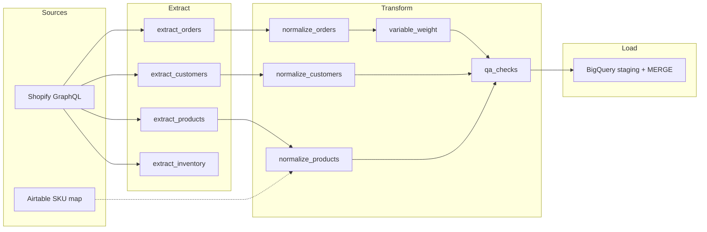

# Feller's Ranch Data Funnel

ETL pipeline that pulls data from **Shopify** (and eventually **Airtable** for SKU mapping), normalizes it for analytics, runs QA checks, and loads into **Google BigQuery** via idempotent staging + MERGE upserts.

---

### Data flow



---

## Project structure

```
Feller's Ranch Data Funnel/
├── .env                    # Secrets (not committed) — Shopify credentials per store
├── .env.example            # Template for environment variables (to be filled in)
├── .gitignore
├── README.md
├── requirements.txt        # Python dependencies (to be pinned)
│
├── auth/
│   ├── __init__.py
│   └── token_manager.py    # Multi-store Shopify credential loader from .env
│
├── extract/
│   ├── __init__.py
│   ├── shopify_client.py   # GraphQL client wrapper (API 2024-01)
│   ├── extract_orders.py   # Paginated order + line item extraction
│   ├── extract_customers.py
│   ├── extract_products.py
│   ├── extract_inventory.py
│   └── airtable_client.py  # SKU mapping from Airtable (stub)
│
├── transform/
│   ├── __init__.py
│   ├── normalize_orders.py     # → fact_orders, fact_order_lines
│   ├── normalize_customers.py  # → dim_customers
│   ├── normalize_products.py   # → dim_products (+ unmapped list)
│   ├── variable_weight.py      # Flags temp per-lb / by-weight line items
│   └── qa_checks.py            # Pre-load data quality report
│
├── schema/                 # BigQuery table schemas (JSON)
│   ├── fact_orders.json
│   ├── fact_order_lines.json
│   ├── dim_products.json
│   ├── dim_customers.json
│   └── dim_stores.json
│
├── load/
│   ├── __init__.py
│   ├── bigquery_client.py  # Connection, table setup, staging + MERGE upsert
│   ├── load_dims.py        # dim_products, dim_customers, dim_stores
│   └── load_facts.py       # fact_orders, fact_order_lines
│
└── pipeline/
    ├── __init__.py
    ├── run_pipeline.py     # End-to-end ETL entry point
    └── scheduler.py        # Scheduled runs (not implemented)
```

---

## Module reference

### `auth/`

| File | Purpose |
|------|---------|
| `token_manager.py` | Loads per-store credentials from `.env` using prefix keys. Supports multiple Shopify stores via `STORE_PREFIXES`. |

**Supported stores** (extend in `STORE_PREFIXES`):

| Store key | Env prefix |
|-----------|------------|
| `fellers_ranch` | `FLRS` |
| `conger_pos_1` | `CGAL1` |
| `conger_pos_2` | `CGAL2` |
| `conger_online` | `CGAL3` |

---

### `extract/`

| File | Purpose | CLI |
|------|---------|-----|
| `shopify_client.py` | `run_query(query, variables, store)` — POST to Shopify GraphQL | `python -m extract.shopify_client` |
| `extract_orders.py` | Orders + line items (50/page, cursor pagination) | `python -m extract.extract_orders` |
| `extract_customers.py` | Customers (25/page, 0.5s delay for rate limits) | `python -m extract.extract_customers` |
| `extract_products.py` | Products + variants + weight | `python -m extract.extract_products` |
| `extract_inventory.py` | Inventory items, levels, locations | `python -m extract.extract_inventory` |
| `airtable_client.py` | Canonical SKU mapping (not implemented) | — |

Default store for all extractors: `fellers_ranch` (via `shopify_client.run_query`).

---

### `transform/`

| File | Input | Output |
|------|-------|--------|
| `normalize_orders.py` | Raw Shopify orders | `fact_orders`, `fact_order_lines` |
| `normalize_customers.py` | Raw customers | `dim_customers` (dedupe by email, skip empty email) |
| `normalize_products.py` | Raw products + optional `sku_mapping` | Mapped products + `unmapped_products` |
| `variable_weight.py` | `fact_order_lines` | `(standard_lines, variable_weight_lines)` |
| `qa_checks.py` | All normalized datasets | QA report dict (`passed`, `issues`, `warnings`, `summary`) |

| Module | CLI |
|--------|-----|
| Any transform module | `python -m transform.<module_name>` |

**QA behavior:** Pipeline **fails** if any products lack a canonical SKU (`unmapped_products`). Warnings cover missing customers, $0 revenue, missing SKUs on lines, draft products, etc.

---

### `load/`

| File | Purpose |
|------|---------|
| `bigquery_client.py` | BigQuery client, table creation from `schema/`, idempotent `upsert_rows()` via staging + MERGE |
| `load_dims.py` | Upsert `dim_products`, `dim_customers`, `dim_stores` |
| `load_facts.py` | Upsert `fact_orders`, `fact_order_lines` |

**BigQuery target:** `data-funnel-3015.fellers_ranch` (configured in `bigquery_client.py`).

**Upsert pattern** (idempotent — safe to re-run):

1. Load rows into `{table}_staging` via a load job (`WRITE_TRUNCATE`)
2. `MERGE` staging into the main table, with `ROW_NUMBER` deduplication on the key field
3. Clear the staging table

Uses load jobs instead of streaming inserts to avoid BigQuery streaming buffer issues on `MERGE`.

| Module | CLI |
|--------|-----|
| `bigquery_client.py` | `python -m load.bigquery_client` (creates tables only) |
| `load_facts.py` | `python -m load.load_facts` |
| `load_dims.py` | `python -m load.load_dims` |

---

### `schema/`

JSON schema definitions for all BigQuery tables. Used by `bigquery_client.py` to create tables and validate load jobs.

| File | Table | Key field |
|------|-------|-----------|
| `fact_orders.json` | `fact_orders` | `order_id` |
| `fact_order_lines.json` | `fact_order_lines` | `line_item_id` |
| `dim_products.json` | `dim_products` | `shopify_product_id` |
| `dim_customers.json` | `dim_customers` | `customer_id` |
| `dim_stores.json` | `dim_stores` | `store_id` |

Staging tables (`{table}_staging`) are created automatically during upsert and share the same schema.

---

### `pipeline/`

| File | Purpose |
|------|---------|
| `run_pipeline.py` | Full ETL: setup tables → extract → transform → QA → load |
| `scheduler.py` | Cron / scheduled execution (not implemented) |

**Pipeline steps** (`run_pipeline.py`):

1. **Setup** — create BigQuery tables if missing
2. **Extract** — orders, products, customers, inventory from Shopify
3. **Transform** — normalize, resolve variable-weight lines
4. **QA** — run checks; warnings are logged but load proceeds
5. **Load** — upsert all fact and dimension tables

| Module | CLI |
|--------|-----|
| Full pipeline | `python -m pipeline.run_pipeline` |

---

## Output schemas (normalized)

### `fact_orders`

| Field | Type | Notes |
|-------|------|-------|
| `order_id` | string | Shopify GID |
| `order_name` | string | e.g. `#1001` |
| `created_at` | string | ISO timestamp |
| `financial_status` | string | |
| `fulfillment_status` | string | |
| `total_revenue` | float | |
| `subtotal` | float | |
| `currency` | string | |
| `customer_id` | string \| null | |
| `customer_email` | string \| null | |
| `store` | string | Currently `"fellers_ranch"` |
| `channel` | string | Currently `"online"` |

### `fact_order_lines`

| Field | Type |
|-------|------|
| `order_id`, `line_item_id`, `product_title`, `variant_id`, `sku` | string |
| `quantity` | int |
| `unit_price`, `line_revenue` | float |
| `store` | string |
| `is_variable_weight` | bool (added by `variable_weight.py`) |

### `dim_customers`

| Field | Type |
|-------|------|
| `customer_id`, `email`, `full_name`, `first_name`, `last_name`, `phone` | string |
| `city`, `province`, `country` | string \| null |
| `number_of_orders` | int |
| `total_spent` | float |
| `currency`, `created_at`, `updated_at`, `store` | string |

### Normalized products

| Field | Type |
|-------|------|
| `shopify_product_id`, `shopify_variant_id`, `raw_name`, `canonical_sku` | string |
| `variant_title`, `product_type`, `vendor`, `status` | string |
| `price`, `inventory_quantity`, `weight_value` | number |
| `weight_unit`, `created_at`, `updated_at`, `store` | string |

---

## Setup

### Prerequisites

- Python 3.12+
- Shopify Admin API access (custom app or OAuth token)
- Google Cloud project with BigQuery enabled (`data-funnel-3015`, dataset `fellers_ranch`)
- GCP credentials (Application Default Credentials or `GOOGLE_APPLICATION_CREDENTIALS` pointing to a service account JSON key)
- (Future) Airtable base for SKU mapping

### Installation

```bash
cd "Feller's Ranch Data Funnel"
python -m venv .venv
source .venv/bin/activate   # Windows: .venv\Scripts\activate
pip install -r requirements.txt
```

**Dependencies:**

- `requests` — Shopify GraphQL API
- `python-dotenv` — `.env` credential loading
- `google-cloud-bigquery` — BigQuery load jobs and MERGE queries

### Environment variables

Copy `.env.example` to `.env` and set values per store prefix.

For **Feller's Ranch** (`FLRS`):

```env
FLRS_TOKEN=shpat_...
FLRS_URL=your-store.myshopify.com
FLRS_SHOPIFY_CLIENT_ID=...
FLRS_SHOPIFY_CLIENT_SECRET=...
```

Repeat the same four variables for `CGAL1`, `CGAL2`, `CGAL3` when enabling Conger stores.

### BigQuery authentication

Authenticate with Google Cloud before running the load stage or full pipeline:

```bash
# Option A — service account key file
export GOOGLE_APPLICATION_CREDENTIALS="/path/to/service-account.json"

# Option B — gcloud Application Default Credentials
gcloud auth application-default login
```

Ensure the service account has **BigQuery Data Editor** and **BigQuery Job User** roles on project `data-funnel-3015`.

> **Security:** Never commit `.env` or GCP credential JSON files. Rotate any token that was ever committed or shared.

---

## Running the pipeline

Run from the **project root** so imports resolve (`auth`, `extract`, `transform`, `load`, `pipeline`).

```bash
# Full ETL — extract, transform, QA, load to BigQuery
python -m pipeline.run_pipeline

# Test Shopify connection
python -m extract.shopify_client

# Extract only
python -m extract.extract_orders
python -m extract.extract_customers
python -m extract.extract_products
python -m extract.extract_inventory

# Transform + sample output (each module re-extracts live data)
python -m transform.normalize_orders
python -m transform.normalize_customers
python -m transform.normalize_products
python -m transform.variable_weight

# Full QA report (extract + transform + checks)
python -m transform.qa_checks

# Load only (re-extracts and transforms live data)
python -m load.bigquery_client   # create tables
python -m load.load_facts
python -m load.load_dims
```

---

## Business logic notes

### Variable weight products

Shopify POS uses temporary products (often titled with `per lb`, `/lb`, `variable`, etc.) that can expire ~12 hours after creation. `variable_weight.py` tags these line items so they can be handled separately before they disappear from the catalog.

### Product SKU mapping

`normalize_products.py` accepts a `sku_mapping` dict (`raw_name` or `raw_sku` → `canonical_sku`). Without Airtable, it falls back to the variant SKU or flags rows as **unmapped** (QA failure).

### Multi-store

`shopify_client.run_query(..., store="conger_pos_1")` switches stores. Normalizers currently hardcode `store: "fellers_ranch"` — update when loading multiple channels.

---

## Roadmap

- [x] Implement `load/bigquery_client.py`, `load_dims.py`, `load_facts.py` (staging + MERGE upsert)
- [x] Add BigQuery schema definitions in `schema/`
- [x] Implement `pipeline/run_pipeline.py` (full ETL orchestration)
- [ ] Implement `extract/airtable_client.py` and wire SKU mapping into `normalize_products`
- [ ] Stop pipeline on QA failure (currently logs warnings and continues)
- [ ] Implement `pipeline/scheduler.py`
- [ ] Populate `requirements.txt` and `.env.example`
- [ ] Parameterize `store` / `channel` in normalizers for Conger POS + online

---

## License

Private / internal — Feller's Ranch.
